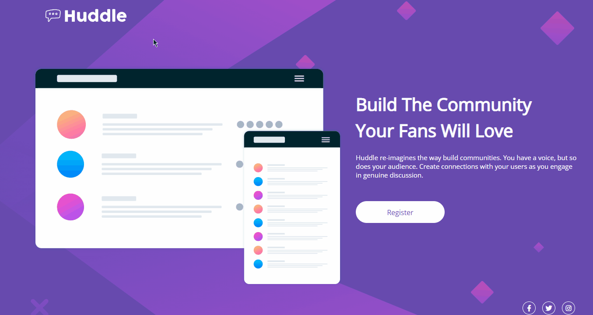
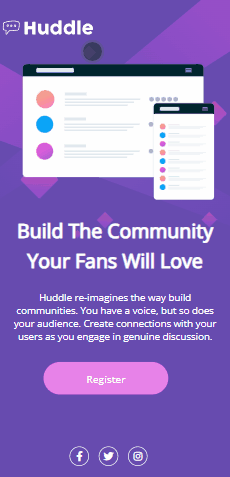

# Quest HTML+CSS avançado DevQuest
Projeto feito a partir do curso de programação DevQuest e do site Frontend Mentor💻

Projeto simples com base em HTML e CSS
## Tela da Quest 
[]

## Tela da Quest versão mobile 📱
[]

## Tecnologias utilizadas 🛠
- HTML
- CSS

### Aprendizado e dificuldades 💡📌
Estou estudando e fazendo curso de programação como iniciante na área. Com essa Quest consegui colocar em prática os conceitos e aprendizados do html e css que estudei até então. Tive algumas dificuldades em relação a lembrar para que e oque cada tag serve, lembrar de funções que podem auxiliar mais do que outras e também dificuldade em deixar o site responsivo com as media queries. Tenho certeza que estarei melhorando bastante e conseguindo enteder cada vez mais sobre programção ao longo do curso e do estudo. 
